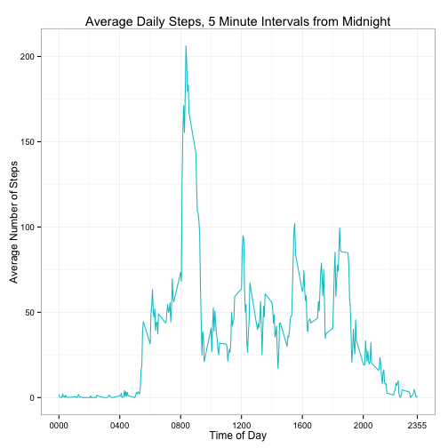
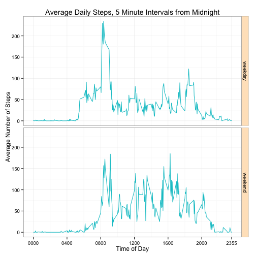

# Reproducible Research: Peer Assessment 1
The data for this assignment was collected by a personal activity monitoring device.  The data consists of observations of an anonymous individual collected during the
months of October and November, 2012.  It shows the number of steps taken at 5 minute intervals of the diurnal cycles during the two months.  For some days no data was recorded; that is shown by NAs in the data table.  

## Loading and preprocessing the data  
The data file must be in the working directory; it may be zipped or unzipped. It is formatted as a csv file. The data.table library is used because of its execution speed and enhanced query capabilities.  Initial checking of the data is done to identify missing data entries.  A truncated, clean data.table free of NAs is constructed, from
which the initial data summary and plots are generated.

```r
# The data file, whether zipped or unzipped, must be in the working directory.
suppressMessages(library(data.table))
suppressMessages(library(dplyr))
suppressMessages(library(ggplot2))
if("activity.csv" %in% dir()) {
        actDT<-fread("activity.csv")	
} else {
	unzip("activity.zip")
	actDT<-fread("activity.csv")			
}  
glimpse(actDT)
```

```
## Observations: 17,568
## Variables: 3
## $ steps    (int) NA, NA, NA, NA, NA, NA, NA, NA, NA, NA, NA, NA, NA, N...
## $ date     (chr) "2012-10-01", "2012-10-01", "2012-10-01", "2012-10-01...
## $ interval (int) 0, 5, 10, 15, 20, 25, 30, 35, 40, 45, 50, 55, 100, 10...
```

```r
# Get and save the number of missing/NA entries
numMissingValues<-table(is.na(actDT[,steps]))[[2]]
# Add a factor column categorizing day types as weekday and weekend
dow<-weekdays(actDT[,as.Date(date)])
dowLookup<-c("Sunday"= "weekend","Saturday" = "weekend", "Monday" = "weekday", "Tuesday" = "weekday", "Wednesday" = "weekday", "Thursday" = "weekday", "Friday" = "weekday")
daytype<-unname(dowLookup[dow])
actDT[,daytype:=as.factor(daytype)]
# Produce a clean data.table
cleanDT<-actDT %>% filter(!is.na(steps))
glimpse(cleanDT)
```

```
## Observations: 15,264
## Variables: 4
## $ steps    (int) 0, 0, 0, 0, 0, 0, 0, 0, 0, 0, 0, 0, 0, 0, 0, 0, 0, 0,...
## $ date     (chr) "2012-10-02", "2012-10-02", "2012-10-02", "2012-10-02...
## $ interval (int) 0, 5, 10, 15, 20, 25, 30, 35, 40, 45, 50, 55, 100, 10...
## $ daytype  (fctr) weekday, weekday, weekday, weekday, weekday, weekday...
```

## What is the mean total number of steps taken per day?


```r
# Create a plot data.table
plotDT<-cleanDT[,sum(steps),by=date]
histLabs<-labs(title="Total Daily Steps",x="Daily Steps",y="Number of Days")
rangeEnds<-range(plotDT[,V1])
onePlot<-ggplot(plotDT, aes(x=V1))+
	geom_histogram(colour="white",fill="turquoise3",binwidth=diff(rangeEnds)/11)+
	histLabs+
	theme_bw()
print(onePlot)
```

 

```r
# Calculate and display the mean and median steps
paste("The mean is",round(mean(cleanDT[,sum(steps),by=date][[2]]),digits=2),sep=" ")
```

```
## [1] "The mean is 10766.19"
```

```r
paste("The median is",median(cleanDT[,sum(steps),by=date][[2]]),sep=" ")
```

```
## [1] "The median is 10765"
```

## What is the average daily activity pattern?
The following time series plot shows how the magnitude of activity varies throughout the diurnal cycle.

```r
# Create the plot table
plotDT<-cleanDT[,mean(steps),by=interval]
# Create labels, and scale and label vectors for the time series plot
timeLabelMain<-"Average Daily Steps, 5 Minute Intervals from Midnight"
timeLabelX<-"Time of Day"
timeLabelY<-"Average Number of Steps"
tsLabs<-labs(title=timeLabelMain,x=timeLabelX,y=timeLabelY)
timeScaleX<-c(0,400,800,1200,1600,2000,2355)
timeScaleLabelX<-c("0000","0400","0800","1200","1600","2000","2355")
# Plot the time series
twoPlot<-ggplot(plotDT,aes(y=V1,x=interval))+
  geom_line(colour="turquoise3")+
  scale_x_continuous(breaks=timeScaleX,labels=timeScaleLabelX)+
  tsLabs+
  theme_bw()
print(twoPlot)
```

 

```r
# Find, format, and display the time of maximum step activity
maxStepsIndex<-order(cleanDT[,mean(steps),by=interval][[2]])[288]
setkey(cleanDT,date)
rawTimeInterval<-as.character(cleanDT["2012-10-15",
  3,with=FALSE]$interval[maxStepsIndex])
while(nchar(rawTimeInterval)<4) {
  rawTimeInterval<-paste("0",rawTimeInterval,sep="")
}		
paste("The average time interval of maximum step activity is",rawTimeInterval,sep=" ")
```

```
## [1] "The average time interval of maximum step activity is 0835"
```


## Imputing missing values  
Here we generate a total of 2304 values to replace the missing values shown by the NAs.  The values are generated by sampling the total population of weekend days, by interval, for each weekend day that lacks values and then imputing that sample, by interval, as the values for that day.  The same is done for weekday days. 

```r
# Display the number of missing values.
paste("The number of missing values is ",numMissingValues,sep="")
```

```
## [1] "The number of missing values is 2304"
```

```r
# Replace the NA values in the steps variable with sampled values
set.seed(80677)
weekendNA<-unique(actDT[,.(steps,date,daytype)][is.na(steps)][daytype=="weekend"][[2]])
weekdayNA<-unique(actDT[,.(steps,date,daytype)][is.na(steps)][daytype=="weekday"][[2]])
for(i in seq_along(weekendNA)){
  actDT$steps[actDT[,date==weekendNA[i]]]<-cleanDT[,sample(steps,1,replace=TRUE),by=.(interval,daytype)][daytype=="weekend"][[3]]  
}
for(i in seq_along(weekdayNA)){
  actDT$steps[actDT[,date==weekdayNA[i]]]<-cleanDT[,sample(steps,1,replace=TRUE),by=.(interval,daytype)][daytype=="weekday"][[3]]  
}
plotDT<-actDT[,sum(steps),by=date]
rangeEnds<-range(plotDT[,V1])
# Plot the new histogram	
threePlot<-ggplot(plotDT, aes(x=V1))+
	geom_histogram(colour="white",fill="turquoise3",binwidth=diff(rangeEnds)/11)+
	histLabs+
	theme_bw()
print(threePlot)
```

 

The mean with imputed values shows an decrease from that without the imputed values, while the median is unchanged.


```r
# Get the new mean and median        
paste("The mean with imputed values is",round(mean(actDT[,sum(steps),by=date][[2]]),digits=2),sep=" ")
```

```
## [1] "The mean with imputed values is 10714.52"
```

```r
paste("The median with imputed values is",median(actDT[,sum(steps),by=date][[2]]),sep=" ")
```

```
## [1] "The median with imputed values is 10765"
```

## Are there differences in activity patterns between weekdays and weekends?


```r
# Generate variables and panel plot the two time series
plotDT<-actDT[,.(mean(steps)), by=.(interval,daytype)]
# Plot the time series
fourPlot<-ggplot(plotDT,aes(y=V1,x=interval))+
  geom_line(colour="turquoise3")+
  scale_x_continuous(breaks=timeScaleX,labels=timeScaleLabelX)+
  tsLabs+
  facet_grid(daytype ~ .)+
  theme_bw()+
  theme(strip.background=element_rect(fill="bisque"))
print(fourPlot)
```

 

Clearly, there is a different pattern of steps taken on weekdays as compared to weekends.


